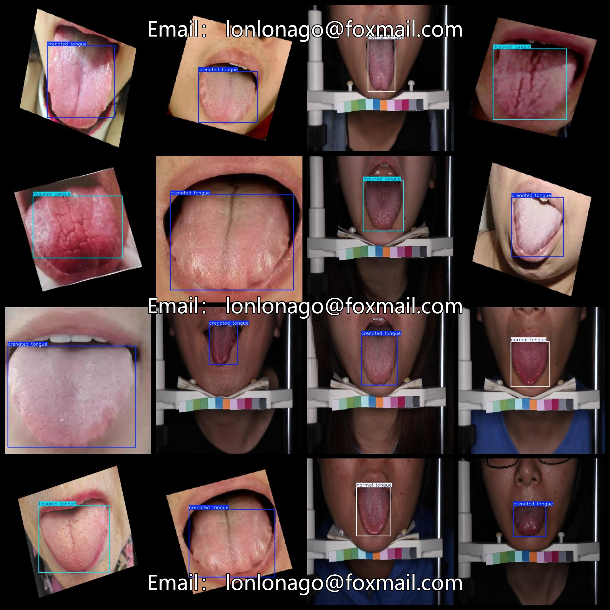

# [Object Detection] Tooth Mark Tongue Crack Tongue Dataset 671 images YOLO+VOC format

[Object Detection] The dataset of teeth marks, fissure tongue and crack tongue is 671 images in YOLO+VOC format.

Dataset format: VOC format + YOLO format

The zip file contains three folders, each storing image files, XML files, and TXT files.

In the JPEGImages folder, there are a total of 671 jpg images.

In the Annotations folder, there are a total of 671 XML files.

In the labels folder, there are a total of 671 TXT files.

Number of labels: 3

Label names: ["crenated tongue", "fissured tongue", "normal tongue"]

Label names: ["Pitted Tongue", "Cracked Tongue", "Normal Tongue"]

Each label's number of bounding boxes (notice that the order of classes in Yolo format does not correspond to this, but is based on the classes.txt in the labels folder):

crenated tongue bounding box count = 257

fissured tongue bounding box count = 153

normal tongue bounding box count = 261

Total bounding box count: 671

Image resolution: Clear

Image enhancement: Yes

Label shape: Rectangular bounding boxes, used for target detection recognition

Important Note: No warranty given regarding the accuracy or weights of the trained models. The dataset provides accurate and reasonable annotations only.
## Images

---

Here is a pay link on Stripe (https://buy.stripe.com/3cs8yP7sY87d0vu9AB). Please contact me lonlonago@foxmail.com after funding $89, and I will send you a complete data files, thank you!

